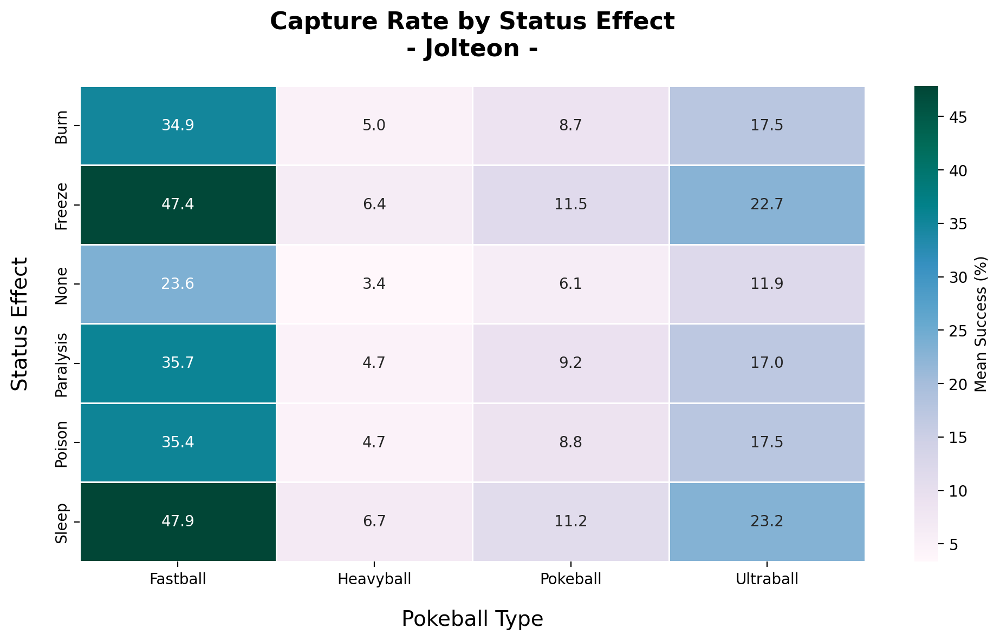

# TP0: Introducción al Análisis de Datos
## 1. Acerca de poekbolas
### a\) Ejecutando la función 100 veces, para cada Pokemon en condiciones ideales \(HP:100 %, LVL 100\) ¿Cuál es la probabilidad de captura promedio para cada pokebola?
Las probabilidad de captura promedio pueden ser visualizadas en la tabla:

| Tipo de pokebola | Efectividad promedio |   Desviación estandar  |  Error estándar de la muestra  |
|:----------------:|:--------------------:|:-----:|:-----:|
| fastball         | 0.106                | 0.103 | 0.046 |
| heavyball        | 0.098                | 0.111 | 0.049 |
| pokeball         | 0.084                | 0.100 | 0.045 |
| ultraball        | 0.198                | 0.307 | 0.137 |

Los mismo resultados pueden visualizarse en el siguiente histograma

### b\) ¿Es cierto que algunas pokebolas son más o menos efectivas dependiendo de propiedades intrínsecas de cada Pokemon? Justificar.
Si, la efectivcidad de ciertas pokebolas es dependiente de propiedades intrinsencas del pokemon en la que es utilizada.

En la grafica anterior se visualiza la razon entre la probabilidad de captura de cada pokebola especial contra la pokebola comun que fue tomada como base de referencia. Esto se hizo para eliminar la dependencia correspondiente al factor "catch_rate" de cada pokemon y ebtonces poder analizar cada pokebola en base a si misma y a los demas factores inherentes de cada pokemon.
Del histograma observamos que la unica pokebola especial con tasa de efectividad constante sin importar el pokemon es la ultraball, con una tasa de efectividad del doble que la pokebola común.
Por otro lado, podemos ver que las barras naranjas, correspondientes a la heavyball, son las unicas que no conservan su valor entre pokemons. Inspirandonos en el nombre de la heavyball como guia y ordenando las tasas de manera efectiva llegamos a la siguiente grafica:

Por encima de un peso umbral, que pareceria estar entre el peso de mewtwo y el de onix, la heavyball mejora la tasa de captura con respecto a la pokeball común. Para analizar porque se pierde esta proporcionalidad por debajo del umbral analizaremos las probabilidades absolutas presentadas en la siguiente tabla:
|  Pokemon | Pokeball CR | Heavyball CR | Diferencia |  Peso  |
|:--------:|:-----------:|:------------:|:----------:|:------:|
| Caterpie |    0.3302   |    0.3115    |   -0.0187  |   6.4  |
|  Jolteon |    0.0635   |    0.0341    |   -0.0294  |   54   |
|  Mewtwo  |    0.0037   |    0.0010    |   -0.0027  |   269  |
|   Onix   |    0.0574   |    0.0844    |   +0.027   |   463  |
|  Snorlax |    0.0331   |    0.0666    |   +0.0335  | 1014.1 |

Por debajo del umbral se penaliza el CR (Catch rate) por un valor fijo de 2-3%, salvo en el caso de mewtwo que ya tiene un catch rate tan bajo que la penalidad satura en un valor cercano a 0.3%. Y por encima del umbral tenemos la relación inversa, donde se aplica un bonus de 2-3% al CR. Esto no se puede apreciar correctamente en las graficas de barras debido a que al tomar el catch rate de la pokebola se pasan de los CR absolutos a los relativos. Tambien por esto los pokemons livianos con CR mas bajo parecen ser los mas penalizados en las graficas de barras, ya que una penalidad de 2-3% pesa mas fuerte proprocionalmente en un pokemon que tiene un CR de 6% como jolteon que en uno con CR de 33% como caterpie.

Finalmente, analizando las barras azules correspondientes notamos que la tasa de efectividad es igual a la de la pokebola comun salvo para dos pokemons: jolteon y mewtwo. Tomando el nombre de la pokebola como pista, como en el caso de la heavyball, graficamos las tasas de efectividad de captura junto a la velocidad de cada pokemon:

En este caso tambien parece existir un umbral de velocidad por el cual se aplica un multiplicador de 4 veces la tasa de captura de la pokemon normal. Este umbral debe existir en algun lugar entre las velocidades de onix y la de jolteon 70-130. Por debajo de este umbral la tasa de captura es igual a la de una pokebola comun.

## 2. Acerca del estado del Pokemon
### a\) ¿Las condiciones de salud tienen algún efecto sobre la efectividad de la captura? Si es así, ¿Cuál es más o menos efectiva?

Para responder esta pregunta realizamos 10000 corridas para todos los efectos de salud y todas las pokebolas, utilizando a Jolteon como ejemplo. La decisión de utilizar a Jolteon es que es uno de los pokemons con tasa de captura media, lo que significa que estamos mas lejos de saturar a tasas de capturas muy bajas o muy altas. Para visualizar los resultados tenemos las siguientes graficas:

